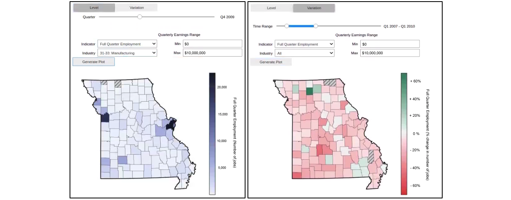
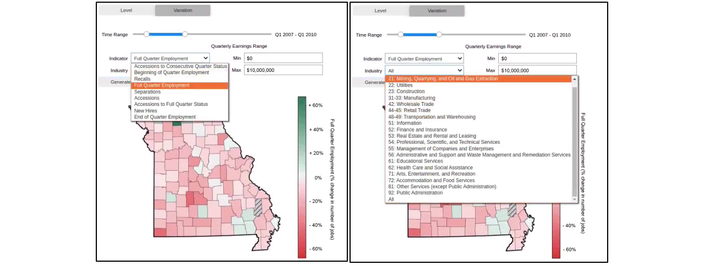

# Missouri Workforce Dashboard

## Introduction
The dashboard prototype presented here is based on micro-data from Missouri Unemployment Insurance Wage Records and QCEW data.

The prototype is intended to illustrate a number of possible applications for the Missouri Department of Labor. More measures and applications could be developed by class participants.
1. It shows levels and changes in standardized measures on earnings and employment outcomes of Missouri workers by county and over time.
1. It provides a sliding scale to see the geographic distribution of workers in different income categories and different time periods
1. If linked to other agency data (such as Corrections and Human Services), it could provide outcomes for sub-populations of interest to more agencies.
1. Linked to data for other states, such as Illinois, it could provide information about earnings and employment outcomes for Missouri workers who also have work in Illinois.

The source code will be provided to participants in the Applied Data Analytics class, and they will be shown how to customize and enhance the results. The work can also be used as input to develop new products of interest, for example, in conjunction with app developer.

## Dashboard Features

### Visualizing Levels and Variation across Geography

__Fig. 1: Visualizing Level (left) and Variation (right) of a Metric across Missouri Counties__
*The dashboard on the left visualizes the level of Manufacturing Full-Quarter Employment jobs in Q4 of 2009. The dashboard on the right visualizes the variation in on Full Quarter Employment jobs across all industries between Q1 of 2007 and Q1 of 2010.*

The dashboard’s “Level” mode enables the user to visualize a metric at a given year and quarter across the different counties of Missouri. The color scale highlights the state’s economic drivers, and regional specialized clusters can be identified by subsetting to specific industries. While overall jobs counts are driven by the cities of Kansas City and St. Louis (Fig. 1), other industries are localized elsewhere in the state (Public Administration in Jefferson City, for example).

The dashboard also offers the possibility to view the variation of a metric between two quarters. Counties in dark green have shown the strongest growth over the time period, while the ones in red have struggled the most. This visualization offers useful insight into employment dynamics and trends, instead of a static view at a given moment.

### Tailored and Customizable Metrics

__Fig. 2: Dashboard metrics (left) and industry subsets (right)__
*The dashboard can visualize different metrics (left) – including QWI metrics developed in in the context of the Census LEHD program –, subsetting the data by different industries (right).*

The dashboard offers the possibility to visualize a large range of tailored metrics. Some are standard employment statistics, such as total jobs, average wages. The second set of metrics we have included are the QWI Employment Statistics metrics. This set of economic indicators were developed by the state Labor Market Information agencies in conjunction with the Census Bureau’s LEHD program. The Illinois Department of Employment Security has provided code that replicates those measures; these standardized measures can be used for each state.

### Comparing Employment Dynamics Across Borders

__Fig. 3: Comparing total earnings with Illinois border counties__
*The dashboard can include border counties from the states that provide data to the ADRF.*

Because the Administrative Data Research Facility has data for both Illinois and Missouri, the dashboard can present data from bordering state counties in order to provide insight into cross-border employment dynamics. This can provide valuable insight into evaluating state-specific policies, especially in cities like St. Louis which have substantial cross border employment activity.
